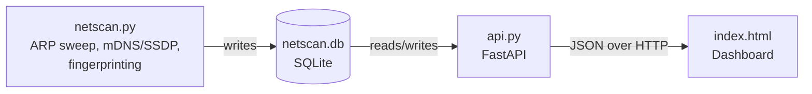

# Network-Scanner-Dashboard

Home network discovery, device fingerprinting, and monitoring — with a live dashboard.

NetScan sweeps your local network, identifies what's connected using multiple independent signals (not just port-guessing), tracks devices over time in SQLite, and serves the results through a REST API and web dashboard. Built to flag unrecognized devices on a home network, not just list IPs.

## Features

- **ARP-based device discovery** across your local subnet
- **Manufacturer identification** via offline OUI (MAC vendor) lookup
- **Multi-signal device/OS classification**, in order of reliability:
  1. SSDP device self-description (`friendlyName` / `modelName` from UPnP)
  2. mDNS service advertisements (AirPlay, Chromecast, HomeKit, printers, etc.)
  3. Service banner grabbing (SSH version strings, HTTP `Server` headers)
  4. Passive TCP/IP stack fingerprinting (TTL + TCP window size) as a fallback
- **Confidence scoring** (0–100, High/Medium/Low) so you can see *how sure* the tool is about each identification, not just a single guess
- **Persistent device history** in SQLite, keyed by MAC address (not IP) so re-scans, DHCP lease changes, and devices going offline don't lose data
- **New-device detection** — flags anything never seen on the network before
- **Manual approval workflow** — mark devices as trusted; that decision survives every future scan
- **REST API** (FastAPI) serving device data as JSON
- **Web dashboard** — a radial network topology map plus a filterable, sortable device table with one-click approve/unapprove

## Architecture



| Component | Role | Needs root/elevated privileges? |
|---|---|---|
| `netscan.py` | Scans the network, enriches results, writes to SQLite | Yes (raw ARP/TCP packets) |
| `netscan.db` | Persistent device store (SQLite, WAL mode) | No |
| `api.py` | Serves device data as JSON, handles approvals | No |
| `index.html` | Browser dashboard — topology map + device table | No (runs client-side) |

## Requirements

- Python 3.9+
- [Npcap](https://npcap.com/) (Windows only) — required for scapy's packet capture
- Administrator/root privileges to run the scanner (raw sockets)

```bash
pip install scapy fastapi "uvicorn[standard]"
```

## Quick Start

### 1. Get an OUI (MAC vendor) database
Not bundled — download once and keep it offline (see [Design Notes](#design-notes) for why):

```bash
curl -o oui.txt https://standards-oui.ieee.org/oui/oui.txt
```

Place `oui.txt` in the same directory as `netscan.py`.

### 2. Run a scan

```bash
# Auto-detect your local subnet
sudo python netscan.py

# Or specify a range explicitly
sudo python netscan.py 192.168.1.0/24
```

On Windows, run your terminal as Administrator instead of using `sudo`.

This prints a report to the terminal and writes results to `netscan.db`:

```
================================================================================
                       NETSCAN PIPELINE - DISCOVERY REPORT
================================================================================
Target Range : 192.168.1.0/24
Hosts Alive  : 4
Unknown Vendor Devices : 1
Low Confidence IDs     : 1
New Devices This Scan  : 1
Pending Approval       : 4
================================================================================
IP Address      Hostname             Device / OS Guess            Confidence   Active Ports
--------------------------------------------------------------------------------------------
192.168.1.15    workstation-01.local Windows Machine              High (80)    [80, 443, 445]
192.168.1.42    nas-storage.local    Linux / Server               Medium (55)  [22, 80]
192.168.1.105   iPhone-user.local    Apple (iPhone/iPad)          Medium (60)  [62078]
192.168.1.187   Unknown-Host         Generic Endpoint             Low (15)     []  *** NEW DEVICE *** *** UNKNOWN VENDOR *** [PENDING APPROVAL]
```

Re-run it anytime — devices are matched by MAC address, so approvals and first-seen history persist across scans.

**CLI options:**

| Argument | Purpose |
|---|---|
| `[cidr]` (positional) | Target range, e.g. `192.168.1.0/24`. Defaults to auto-detected local subnet |
| `--reset-db` | Wipes `netscan.db` and starts fresh |

### 3. Start the API

```bash
uvicorn api:app --host 0.0.0.0 --port 8000
```

Interactive API docs: `http://localhost:8000/docs`

**Endpoints:**

| Method | Route | Description |
|---|---|---|
| `GET` | `/devices` | All known devices. Supports `?pending_only=true`, `?unknown_only=true` |
| `GET` | `/devices/{mac}` | Single device detail |
| `GET` | `/devices/{mac}/history` | Sighting history (every scan this device appeared in) |
| `PATCH` | `/devices/{mac}/approve` | Body `{"is_approved": true/false}` — approve or revoke trust |
| `GET` | `/stats` | Summary counts (online, pending, unknown vendor, low confidence) |
| `GET` | `/health` | Confirms the API can reach the database |

### 4. Open the dashboard

Open `index.html` directly in a browser (the API must be running on port 8000). It shows:

- A radial topology map — router at the center, devices around it, colored by approval/online status
- A filterable table (All / Pending Approval / Unknown Vendor / Online)
- One-click approve/unapprove per device
- Expandable rows with full detail: MAC, open ports, banners, mDNS/SSDP data, first/last seen

## Typical Workflow

```bash
# Scan once
sudo python netscan.py 192.168.1.0/24

# Or scan on a schedule with cron (Linux/macOS), e.g. every 15 minutes:
*/15 * * * * cd /path/to/netscan && sudo python netscan.py 192.168.1.0/24

# Keep the API running continuously
uvicorn api:app --host 0.0.0.0 --port 8000

# Open index.html whenever you want to check in on your network
```

## Project Structure

```
.
├── netscan.py                  # Scanner: ARP sweep, mDNS/SSDP, fingerprinting, SQLite persistence
├── api.py                      # FastAPI backend serving device data as JSON
├── index.html                  # Dashboard: topology map + device table
├── oui.txt                      # IEEE OUI database (download separately, see Quick Start)
├── netscan.db                   # Created automatically on first scan (SQLite, WAL mode)
│
├── Dockerfile.scanner            ┐
├── Dockerfile.api                 │  Optional Docker deployment
├── docker-compose.yml             │  (see DEPLOYMENT.md)
├── entrypoint.sh                  │
├── requirements-scanner.txt       │
├── requirements-api.txt          ┘
└── DEPLOYMENT.md                # Docker setup guide and known platform limitations
```

## Docker Deployment (optional)

A containerized deployment (scanner + API in separate containers, sharing a persistent volume) is available — see [`DEPLOYMENT.md`](./DEPLOYMENT.md).

**Note:** the scanner container requires host networking to see real devices on your LAN, which works on native Linux Docker hosts but not Docker Desktop for Mac/Windows (containers run inside a VM there). `DEPLOYMENT.md` covers the workaround.

## Design Notes

- **Devices are keyed by MAC address, not IP.** IPs rotate under DHCP; MAC addresses don't. This is what makes "new device" detection and approval persistence actually reliable across scans.
- **The OUI database is static/offline by design**, not fetched live. A network scanning tool that depends on internet access to identify devices on a *possibly broken* network defeats some of its own purpose. Refresh manually by re-downloading `oui.txt` when needed.
- **Confidence scoring favors self-reported data.** SSDP's UPnP description and mDNS service advertisements are the device telling you what it is; TTL/TCP-window fingerprinting is an inference and is weighted accordingly lower.
- **Approvals never get overwritten by re-scans.** Only new devices default to unapproved; existing approval state is preserved on every subsequent scan.
- **`is_approved == false` is the dashboard's primary red-flag signal** — surfaced as a red pill on the device card/row, matching the original design goal of visually flagging unrecognized devices.

## Known Limitations

- Requires root/Administrator privileges (raw packet access).
- ARP scanning only covers the local broadcast domain — devices on other VLANs/subnets won't be discovered.
- mDNS/SSDP discovery requires multicast to reach the scanning host; some virtualized or containerized network setups block this (see `DEPLOYMENT.md`).
- TTL/window-based OS fingerprinting can be inaccurate behind NAT, VPNs, or traffic-shaping middleboxes — this is why it's the lowest-weighted signal in confidence scoring.
- No authentication on the API or dashboard — intended for trusted home network use only. Do not expose port 8000 beyond your LAN without adding auth.

## Roadmap

- [ ] Cross-platform subnet auto-detection (currently Linux-only via `ip route`)
- [ ] `argparse`-based CLI (`--timeout`, `--passive`, `--json`, etc.)
- [ ] Passive-only discovery mode (listen without transmitting)
- [ ] Docker deployment hardening (healthchecks, scan-on-startup dependency)
